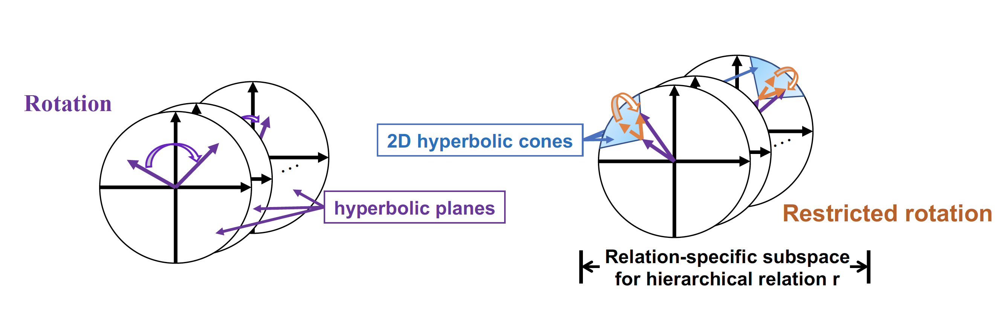

## Modeling Heterogeneous Hierarchies with Relation-specific Hyperbolic Cones

This is the official codebase for the paper [Modeling Heterogeneous Hierarchies with Relation-specific Hyperbolic Cones](https://arxiv.org/abs/2110.14923).

## Overview
We present **ConE** (**Con**e **E**mbedding for knowledge graphs), the first knowledge graph (KG) embedding method that can capture the transitive closure properties of heterogeneous hierarchical relations as well as other non-hierarchical properties. The figure below shows an illustration of our model.



This is the PyTorch implementation of our proposed ConE model based on the code framework provided by [RotatE](https://arxiv.org/abs/1902.10197)' [repo](https://github.com/DeepGraphLearning/KnowledgeGraphEmbedding) for knowledge graph embedding.

## Implemented features

#### Datasets
 - [x] WN18RR
 - [x] DDB14
 - [x] GO21
 - [x] FB15k-237

**Notice**: We propose **GO21**, a hierarchical biological knowledge graph containing genes, proteins, drugs and diseases as entities. Please cite our paper if you use this dataset.

#### Models:
 - [x] RotatE
 - [x] pRotatE
 - [x] TransE
 - [x] ComplEx
 - [x] DistMult
 - [x] RotC (our)
 - [x] ConE (our)

**Notice**: RotC is the degenerate version of ConE that uses empty relation-specific subspace. RotC is utilized to initialize the embedding for ConE, to stabilize the training procedure.

#### Tasks and Evaluation Metrics:

 - Knowledge graph completion:
    - [x] MRR, MR, HITS@1, HITS@3, HITS@10 (filtered)
 - Ancestor-descendant prediction:
    - [x] mAP, AUROC
 - LCA prediction:
    - [x] HITS@1, HITS@3, HITS@10

#### Loss Function:

 - [x] Uniform Negative Sampling
 - [x] Self-Adversarial Negative Sampling
 - [x] Cone angle loss (our)

## Usage

Knowledge Graph Data:
 - `entities.dict`: a dictionary mapping entities to unique ids
 - `relations.dict`: a dictionary mapping relations to unique ids
 - `train.txt`: the KGE model is trained to fit this data set
 - `valid.txt`: create a blank file if no validation data is available
 - `test.txt`: the KGE model is evaluated on this data set
 - `relation_category.txt`: a dictionary mapping relations to their type (1-1 indicates non-hierarchical, 1-M indicates hyponym, M-1 indicates hypernym), required for ConE model
 - `class_test_X.txt`: Test data for ancestor-descendant prediction task, *X*=easy: 0% inferred descendant pairs, *X*=medium: 50% inferred descendant pairs, *X*=hard: 100% inferred descendant pairs
 - `lca_test_X.txt`: LCA prediction under *X*-hop is evaluated on this data set

## Training and Evaluation of ConE
#### Train

The `run.sh` script provides an easy way to search hyper-parameters (such as batch size, learning rate, etc) during training. For example, this command train a ConE model on WN18RR dataset with GPU 0.
```
bash run.sh train ConE wn18rr 0 1 1024 50 500 10 0.5 0.001 40000 4 -de \
    --tail_batch_only --do_valid --valid_steps 20000 --save_checkpoint 40000 \
    --train_with_relation_category --uni_weight --lr_decay_epoch "30000" \
    --do_test_relation_category --cone_penalty --fix_att 100 \
    --w 0.5 --pretrained "./models/RotC_wn18rr_1/checkpoint/ckpt_39999"
```
Check argparse configuration at `codes/run.py` for more arguments and more details.

Moreover, we provide example training scripts for ConE in folder `examples/` to reproduce our results.

#### Test

Trained model is automatically saved in folder `models/`, evaluations can be conducted using the following commands.

```
bash run.sh category ConE wn18rr 0 1 1024 50 500 0.1 0.5 0.001 20000 4 -de \
    -init models/ConE_wn18rr_1 -ckpt "ckpt_39999"  --fix_att 100 \
    --do_test_relation_category --do_classification --do_lca 1 \
    --pretrained "./models/RotC_wn18rr_1/checkpoint/ckpt_39999"
```
The model will be evaluated on three tasks: KG completion task, ancestor-descendant prediction task and LCA prediction task.

#### Extend to more datasets
For hierarchical KG datasets, the training of ConE requires a pretrained RotC model to initialize the embedding. We refer to `examples/WN18RR.sh` for an example.

For non-hierarchical KG datasets, RotC model is comparable to many strong baseline models. We refer to `examples/FB15k237.sh` for an example.

## Citation

Please cite our paper if you use our method or dataset in your work (Bibtex below).

```bibtex
@inproceedings{bai2021cone,
   title={Modeling Heterogeneous Hierarchies with Relation-specific Hyperbolic Cones},
   author={Bai, Yushi and Ying, Rex and Ren, Hongyu and Leskovec, Jure},
   booktitle={Advances in Neural Information Processing Systems (NeurIPS)},
   year={2021}
}
```